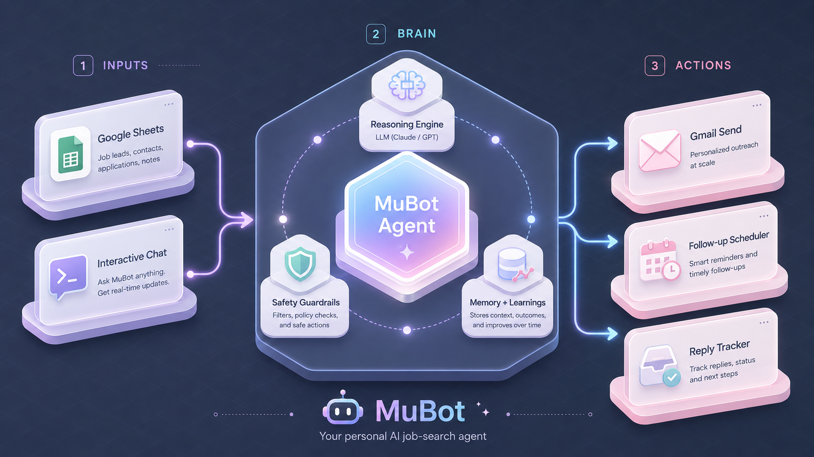

# 🤖 MuBot — My Personal Assistant

> An AI-powered agent that drafts personalized cold emails from job descriptions and manages follow-ups.

[](https://www.python.org/downloads/)
[](https://opensource.org/licenses/MIT)

---

## ✨ What is MuBot?

**MuBot is my personal AI assistant.** It currently reads job descriptions and drafts tailored cold emails that match my experience to their requirements.

```
Me: "Draft an email for the Data Scientist role at Netflix"
MuBot: "Please paste the job description..."

[I paste the full JD]

MuBot: "✉️ Done! Here's your tailored email matching your Python/ML 
        experience to their requirements..."
```

### What's Actually Working

| Feature | Status | Description |
|---------|--------|-------------|
| 💬 **Chat Interface** | ✅ | Interactive chat that asks for JD, company, role |
| 📄 **JD-Enhanced Emails** | ✅ | Matches your skills to job requirements |
| 📧 **Gmail Integration** | ✅ | Sends emails with resume attachments |
| 📊 **Google Sheets** | ✅ | Bulk campaign from spreadsheet |
| 📅 **Follow-up Scheduling** | ✅ | Auto-schedules 3 follow-ups (4/8/10 days) |
| 🔄 **Response Tracking** | ✅ | Auto-checks replies hourly, cancels follow-ups |
| 🛡️ **Safety Controls** | ✅ | Rate limiting, daily limits, confirmations |
| 📝 **Human-Style Prompts** | ✅ | Short, casual emails with phone/LinkedIn |

### What's Not Working (Yet)

| Feature | Status | Note |
|---------|--------|------|
| 🔗 **LinkedIn Integration** | ❌ | Code exists but not wired up |
| 📊 **Pipeline Dashboard** | ❌ | Model exists, UI not implemented |
| 🧪 **A/B Testing** | ❌ | Prompt exists, feature not built |
| 🗄️ **Notion Sync** | ❌ | Placeholder only |
| 🔍 **RAG Search** | ❌ | ChromaDB setup but not used |

---

## 🏗️ Architecture

<p align="center">
  
</p>

**The Flow:**
1. **Input** via Google Sheets or interactive chat
2. **MuBot** reads your profile and drafts personalized emails using job descriptions
3. **You approve** before sending (safety first!)
4. **Gmail** sends with resume attachment
5. **Follow-ups** scheduled automatically

---

## 🚀 Quick Start

### 1. Setup

```bash
git clone https://github.com/MuskanKhandelwal/MuBot.git
cd MuBot

python -m venv venv
source venv/bin/activate
pip install -e "."
```

### 2. Configure

```bash
# Copy example env
cp .env.example .env

# Edit with your keys
nano .env
```

Add to `.env`:
```
OPENAI_API_KEY=sk-your-key-here
```

### 3. Create Your Profile

Edit `data/USER.md`:
```markdown
## Identity
- **Name**: Your Name
- **Email**: your.email@gmail.com
- **Phone**: +1 555-123-4567

## Professional Background
- **Current Title**: Data Scientist
- **Summary**: I have 3+ years building ML models...
- **Key Skills**: Python, SQL, MLOps, GenAI
- **Years of Experience**: 3

## Links
- **LinkedIn**: https://linkedin.com/in/yourname
- **Resume Path**: /path/to/your/resume.pdf
```

### 4. Authenticate Gmail

```bash
python -c "from src.mubot.tools.gmail_client import GmailClient; from src.mubot.config import Settings; import asyncio; asyncio.run(GmailClient(Settings()).authenticate())"
```

---

## 📧 Usage

### Option 1: Bulk Campaign (Google Sheets)

Create a Google Sheet "Job Applications" with columns:
- Company, Role Title, Email, Job Description, Status

```bash
# Send all pending jobs (with confirmation)
python auto_campaign.py --source sheets --limit 10

# Bulk mode (no confirmation prompts)
python auto_campaign.py --source sheets --limit 10 --bulk

# Dry run (preview only)
python auto_campaign.py --source sheets --limit 5 --dry-run
```

### Option 2: Interactive Chat

```bash
python mubot.py
```

**Example session:**
```
🤖 MuBot: Hi! How can I help?

You: Draft an email for Data Scientist at Stripe

🤖 MuBot: Please paste the job description...

You: [paste JD]
You: DONE

🤖 MuBot: ✉️ Draft ready!
      Subject: Data Scientist Role at Stripe
      
      Hi [Name],
      
      I came across the Data Scientist role at Stripe...
      
      [2 more paragraphs]
      
      Best,
      Your Name
      +1 555-123-4567 | linkedin.com/in/you
      
      Send to hiring@stripe.com? (yes/no): 

You: yes
🤖 MuBot: ✅ Sent! 📎 Attached resume.pdf
```

### Option 3: Send Due Follow-ups

```bash
python mubot.py followups
```

### Option 4: Automated Reply Checking (New!)

```bash
# Check for replies once
python auto_campaign.py --check-replies

# Schedule it to run every hour (add to crontab)
0 * * * * cd /path/to/mubot && python auto_campaign.py --check-replies
```

Automatically checks Gmail for replies and cancels scheduled follow-ups for respondents.

---

## ⚙️ Configuration

### Rate Limiting (`.env`)

```bash
# Seconds between emails (for bulk sending)
MIN_EMAIL_INTERVAL_SECONDS=5

# Max emails per day
MAX_DAILY_EMAILS=20

# Require confirmation before send
REQUIRE_SEND_APPROVAL=true
```

### Email Style

Edit `src/mubot/config/prompts_human.py` to change:
- Tone (casual/professional)
- Length constraints
- What to include/exclude

---

## 📁 Project Structure

```
MuBot/
├── auto_campaign.py          # 📧 Bulk email campaigns
├── mubot.py                  # 💬 Interactive chat / unified CLI
│
├── src/mubot/
│   ├── agent/                # Core agent logic
│   │   ├── core.py           # Main JobSearchAgent
│   │   ├── reasoning.py      # LLM email drafting
│   │   └── safety.py         # Rate limits, safety checks
│   ├── tools/
│   │   ├── gmail_client.py   # Gmail API
│   │   └── scheduler.py      # Follow-up scheduling
│   ├── memory/
│   │   ├── manager.py        # File-based memory
│   │   └── models.py         # Data models
│   └── config/
│       ├── prompts_human.py  # XML email prompts
│       └── settings.py       # Config
│
├── integrations/
│   └── google_sheets.py      # Sheets API
│
├── data/                     # Your data (git-ignored)
│   ├── USER.md               # Your profile
│   └── heartbeat-state.json  # Scheduled follow-ups
│
└── credentials/              # API credentials
    └── gmail_credentials.json
```

---

## 🎯 Available Commands

| Command | Works? | Description |
|---------|--------|-------------|
| `Draft an email for [role] at [company]` | ✅ | Interactive JD collection + drafting |
| Bulk Sheets campaign | ✅ | Send to multiple jobs at once |
| Resume attachment | ✅ | Auto-attaches PDF |
| Follow-up scheduling | ✅ | Schedules 3 follow-ups |
| Check follow-ups | ✅ | `mubot.py followups` lists and sends due ones |
| Pipeline tracking | ❌ | Not implemented |
| Response checking | ✅ | Hourly Gmail reply scan, auto-cancels follow-ups |

---

## 🛠️ Tech Stack

| Component | Technology |
|-----------|------------|
| **LLM** | OpenAI GPT-4 |
| **Email** | Gmail API (OAuth) |
| **Data** | Google Sheets |
| **Storage** | Markdown + JSON files |
| **Scheduling** | APScheduler (follow-ups) |
| **Language** | Python 3.11+ |

---

## 📝 Known Limitations

1. **Pipeline tracking has models but no UI** - Data structures exist, interface missing
2. **Notion integration is placeholder only** - Source code removed; `--source notion` is not supported

---

## 🚧 Roadmap

### v0.2 (In Progress)
- [ ] Auto-send scheduled follow-ups
- [ ] Auto-check for replies
- [ ] Web UI for pipeline

### v0.3 (Future)
- [ ] LinkedIn company research
- [ ] Response classification
- [ ] A/B testing prompts

---

## 🤝 Contributing

This is a personal project, but feel free to fork! Open an issue for bugs.

---

## 📄 License

MIT License — use it, modify it, make it yours!

---

<p align="center">
  <b>Built with ❤️ for my job search</b><br>
  <i>More features coming soon...</i>
</p>
